> **⚠️ Important Notice**
> 
> 🚧 **This project is currently under active development** 🚧
> 
> Thoth is not yet ready for production use. The API and features are subject to change without notice. We recommend against using this in production environments until a stable release is available.

# Thoth - Cloud Storage Solution

[](https://opensource.org/licenses/Apache-2.0)
[](https://github.com/Mahmoud02/thoth/actions)
[](https://codecov.io/gh/Mahmoud02/thoth)

<div align="center">
  
  <p><em>Thoth - The Egyptian God of Wisdom, Writing, and Knowledge</em></p>
</div>

## 🏛️ Inspiration

Thoth is inspired by the ancient Egyptian god of wisdom, writing, and knowledge. Just as Thoth was the divine scribe and mediator of the gods, this project aims to be a reliable and intelligent storage solution for modern applications.

## 🚀 Overview

Thoth is an open-source, self-hosted storage solution designed for companies that want S3-like capabilities on their own infrastructure without the complexity of cloud services. Our goal is to provide a simple, no-code solution that lets organizations manage their files on-premise with minimal setup and maintenance.

### Key Capabilities:
- **Built-in File Validation**: Automatic checks for file size, type, and security
- **Pre-configured Rules**: Set up validation rules without writing any code
- **Custom Processing**: Define workflows for file processing on upload
- **Security First**: Built-in scanning and verification for safe file storage

Thoth offers the power of enterprise-grade object storage with the simplicity of a plug-and-play solution, making it perfect for businesses that need reliable, secure file storage without the overhead of cloud services or custom development.

## 🏗️ Architecture

Thoth is built using **Hexagonal Architecture** (Ports & Adapters) to ensure:

- **Maintainability**: Clear separation of concerns
- **Testability**: Easy to write unit and integration tests
- **Flexibility**: Swap components without affecting the core business logic
- **Scalability**: Designed to grow with your needs

### System Architecture

```mermaid
graph TB
    %% External Layer
    Client[Client Applications]
    Ollama[Ollama AI Service<br/>🤖 llama3.2 + nomic-embed-text]
    
    %% Application Layer
    subgraph "Thoth Application"
        API[REST API<br/>📡 Controllers & Swagger]
        Domain[Domain Logic<br/>🧠 Use Cases & Services]
        Storage[Storage Layer<br/>💾 File System + Vector Store]
    end
    
    %% Database Layer
    PostgreSQL[(PostgreSQL 17<br/>🗄️ + pgvector extension)]
    
    %% Main Flows
    Client --> API
    API --> Domain
    Domain --> Storage
    Storage --> PostgreSQL
    
    %% AI Integration
    Domain --> Ollama
    Ollama --> Storage
    
    %% Styling
    classDef external fill:#e3f2fd,stroke:#1976d2,stroke-width:2px
    classDef application fill:#f3e5f5,stroke:#7b1fa2,stroke-width:2px
    classDef database fill:#e8f5e8,stroke:#388e3c,stroke-width:2px
    
    class Client,Ollama external
    class API,Domain,Storage application
    class PostgreSQL database
```



### Key Data Flows

#### 📄 **Document Upload & AI Processing**
```
Client → API → Domain Logic → Storage Layer
                              ↓
                         Ollama (Embedding) → Vector Store → PostgreSQL
```

#### 🔍 **RAG Query Processing**
```
Client → API → Domain Logic → Vector Store (Search)
                              ↓
                         Ollama (Chat) → Response
```

#### ⚙️ **Bucket Management**
```
Client → API → Domain Logic → Storage Layer → PostgreSQL
```

### Core Components

- **API Layer**: RESTful API for client interactions
- **Domain Layer**: Core business logic and entities
- **Infrastructure Layer**: Implementation details (storage, database, etc.)
- **Ports**: Interfaces that define the application's boundaries
- **Adapters**: Concrete implementations of the ports

## 📚 Features

### Core Storage Features
- **Object Storage**: Store and retrieve any type of file or binary data
- **Bucket Management**: Organize your data into logical containers
- **Namespace Support**: Multi-tenancy support for different organizations or teams
- **Extensible Functions**: Custom processing for stored objects
- **REST API**: Simple and consistent API for integration
- **Self-hosted**: Full control over your data

### AI-Powered Features
- **Document Processing**: Automatic text extraction and chunking
- **Vector Search**: Semantic similarity search using embeddings
- **RAG (Retrieval-Augmented Generation)**: AI-powered document querying
- **Intelligent Storage**: AI-assisted file organization and retrieval
- **Multi-Model Support**: Separate models for chat and embeddings
- **Vector Database**: PostgreSQL with pgvector extension for efficient vector operations

## 🛠️ Technology Stack

- **Language**: Java 24
- **Framework**: Spring Boot 3.5.0
- **Build Tool**: Maven
- **Database**: PostgreSQL 17 with pgvector extension
- **AI Integration**: Spring AI 1.0.1
- **AI Models**: 
  - **Chat Model**: Llama 3.2 (latest)
  - **Embedding Model**: nomic-embed-text (768 dimensions)
- **Testing**: JUnit 5, Testcontainers, AssertJ, Mockito
- **Containerization**: Docker

## 🤖 AI Models & Installation

### Required AI Models

Thoth uses two separate AI models for different purposes:

#### 1. Chat Model: Llama 3.2 (latest)
- **Purpose**: Text generation, conversation, and RAG responses
- **Usage**: AI assistant interactions and document query processing
- **Model Size**: ~4.7GB

#### 2. Embedding Model: nomic-embed-text
- **Purpose**: Convert text to numerical vectors for similarity search
- **Dimensions**: 768 (critical for database schema)
- **Model Size**: ~274MB

### Installing AI Models

#### Option 1: Using Ollama (Recommended)

1. **Install Ollama**:
   ```bash
   # macOS
   brew install ollama
   
   # Linux
   curl -fsSL https://ollama.ai/install.sh | sh
   
   # Windows
   # Download from https://ollama.ai/download
   ```

2. **Start Ollama Service**:
   ```bash
   ollama serve
   ```

3. **Pull Required Models**:
   ```bash
   # Pull chat model
   ollama pull llama3.2:latest
   
   # Pull embedding model
   ollama pull nomic-embed-text
   ```

4. **Verify Models**:
   ```bash
   ollama list
   ```

#### Option 2: Using Docker

```bash
# Run Ollama in Docker
docker run -d -v ollama:/root/.ollama -p 11434:11434 --name ollama ollama/ollama

# Pull models
docker exec -it ollama ollama pull llama3.2:latest
docker exec -it ollama ollama pull nomic-embed-text
```

### Model Configuration

The models are configured in `application.properties`:

```properties
# AI Model Configuration
spring.ai.ollama.base-url=http://localhost:11434
spring.ai.ollama.embedding.model=nomic-embed-text
spring.ai.ollama.chat.model=llama3.2:latest
spring.ai.ollama.vectorstore.pgvector.dimensions=768
```

⚠️ **Important**: The embedding dimensions (768) are critical and must match the database schema exactly.

## 🚀 Getting Started

### Development Setup

For local development, we provide a `development-dependencies.yml` file that sets up all necessary services using Docker Compose. This includes:

- **PostgreSQL 17 with pgvector**: The primary database with vector support
- **pgAdmin 4**: Web-based database management tool

To start the development environment:

```bash
docker-compose -f development-dependencies.yml up -d
```

Access the services at:
- PostgreSQL: `localhost:5432`
- pgAdmin: `http://localhost:5050` (email: admin@admin.com, password: admin)

### Testing with Testcontainers

Thoth leverages Testcontainers for reliable integration testing. This allows us to:

- Run tests against real database instances
- Ensure consistent test environments
- Test database migrations and queries with actual PostgreSQL
- Isolate tests using containerized dependencies

Testcontainers automatically manages the lifecycle of Docker containers, spinning up fresh instances for each test class and tearing them down afterward.

To run the tests:

```bash
mvn test
```

### Prerequisites

- **Java 24** or higher
- **Maven 3.6+**
- **PostgreSQL 17+** with pgvector extension
- **Ollama** (for AI models)
- **Docker** (optional, for containerized deployment)
- **Minimum 8GB RAM** (for AI model processing)
- **Minimum 10GB free disk space** (for AI models)

### Installation

1. **Clone the repository**:
   ```bash
   git clone https://github.com/Mahmoud02/thoth.git
   cd thoth
   ```

2. **Start PostgreSQL with pgvector**:
   ```bash
   docker-compose -f development-dependencies.yml up -d
   ```

3. **Install and start Ollama**:
   ```bash
   # Install Ollama
   curl -fsSL https://ollama.ai/install.sh | sh
   
   # Start Ollama service
   ollama serve
   
   # Pull required models
   ollama pull llama3.2:latest
   ollama pull nomic-embed-text
   ```

4. **Build the project**:
   ```bash
   mvn clean install
   ```

5. **Run the application**:
   ```bash
   mvn spring-boot:run
   ```

6. **Verify installation**:
   - API Documentation: `http://localhost:8080/swagger-ui.html`
   - Health Check: `http://localhost:8080/actuator/health`

### Docker Setup

```bash
docker-compose up -d
```

## 📚 API Documentation

Once the application is running, you can access the API documentation at:
- Swagger UI: `http://localhost:8080/swagger-ui.html`
- OpenAPI Docs: `http://localhost:8080/v3/api-docs`

## 🏗️ Project Structure

```
src/
├── main/
│   ├── java/
│   │   └── com/mahmoud/thoth/
│   │       ├── ai/                 # AI Integration Layer
│   │       │   ├── config/         # AI Configuration (Ollama)
│   │       │   ├── controller/     # AI Controllers (RAG, ThothAI)
│   │       │   ├── dto/            # AI DTOs (Query, Response)
│   │       │   └── service/        # AI Services (Document Processing, RAG)
│   │       ├── api/                # REST API Layer
│   │       │   ├── controller/v1/  # Versioned Controllers
│   │       │   ├── doc/            # API Documentation
│   │       │   ├── dto/            # API DTOs
│   │       │   └── mapper/         # Object Mappers
│   │       ├── config/             # Application Configuration
│   │       ├── domain/             # Core Business Logic (Hexagonal Architecture)
│   │       │   ├── model/          # Domain Models
│   │       │   ├── port/           # Ports (Interfaces)
│   │       │   │   ├── in/         # Input Ports (Commands/Queries)
│   │       │   │   └── out/        # Output Ports (Repositories)
│   │       │   └── service/        # Domain Services (Use Cases)
│   │       ├── function/           # Bucket Functions System
│   │       │   ├── annotation/     # Function Metadata Annotations
│   │       │   ├── config/         # Function Configuration
│   │       │   ├── exception/      # Function Exceptions
│   │       │   ├── factory/        # Function Factory
│   │       │   └── impl/           # Function Implementations
│   │       ├── infrastructure/     # Infrastructure Layer
│   │       │   ├── repository/     # Repository Adapters
│   │       │   ├── store/          # Storage Implementations
│   │       │   │   └── impl/sqlite/
│   │       │   │       ├── converter/  # JSONB Converters
│   │       │   │       ├── entity/     # Database Entities
│   │       │   │       └── repository/ # SQLite Repositories
│   │       │   └── StorageService.java
│   │       ├── model/              # Shared Models
│   │       ├── service/            # Application Services
│   │       ├── shared/             # Shared Components
│   │       │   ├── exception/      # Global Exception Handling
│   │       │   └── JsonUtil.java   # JSON Utilities
│   │       └── ThothApplication.java
│   └── resources/
│       ├── application.properties  # Application Configuration
│       └── db/migration/           # Database Migrations
│           ├── V1__Create_Namespace_Table.sql
│           ├── V2__Create_Bucket_Table.sql
│           ├── V3__Create_Object_Table.sql
│           ├── V4__document_chunks.sql
│           ├── V5__Add_Ingested_Column_To_Objects.sql
│           └── V6__Create_Vector_Store_Table.sql
└── test/                          # Test Files
    ├── java/                      # Test Classes
    └── resources/                 # Test Configuration
```

## 🤝 Contributing

Contributions are welcome! Please read our [Contributing Guidelines](CONTRIBUTING.md) for details on our code of conduct and the process for submitting pull requests.

## 📄 License

This project is licensed under the Apache License 2.0 - see the [LICENSE](LICENSE) file for details.

## 🙏 Acknowledgments

- Inspired by the wisdom of Thoth, the ancient Egyptian god of knowledge
- Built with the help of the open-source community
- Special thanks to all contributors and supporters
